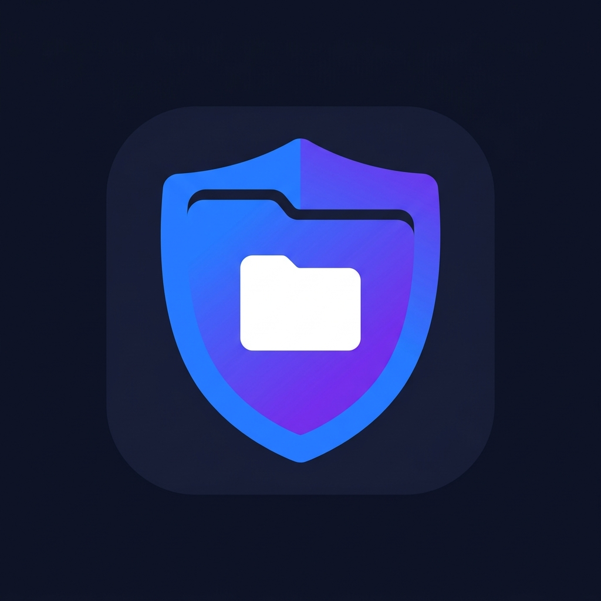
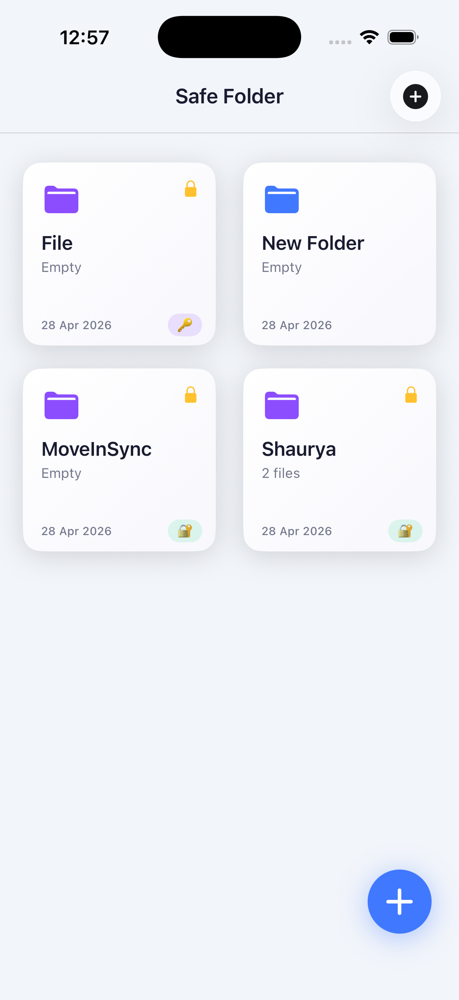
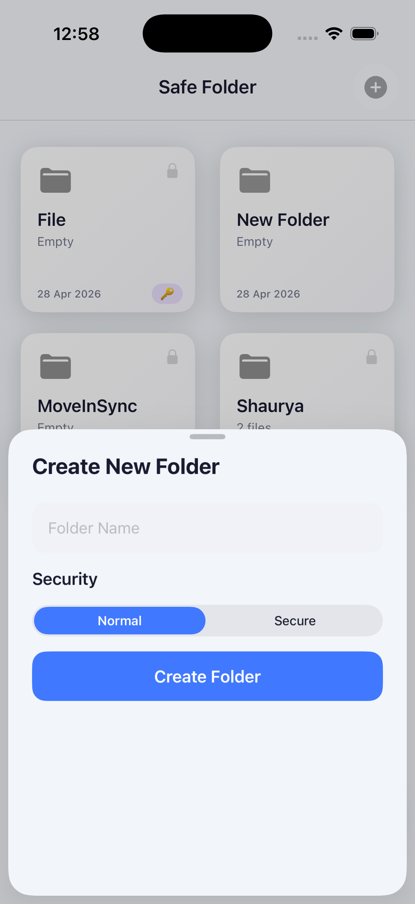
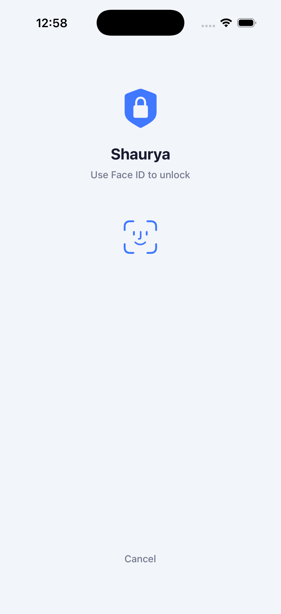
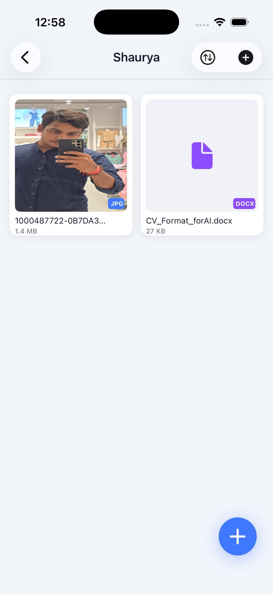
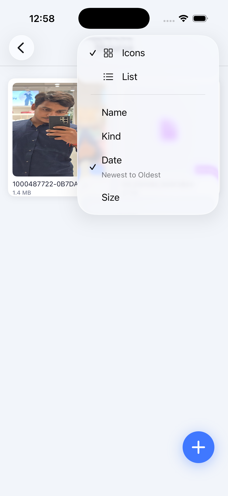

<p align="center">
  
</p>

<h1 align="center">🛡️ Safe Folder</h1>

<p align="center">
  <strong>A premium, production-grade iOS file vault with biometric security</strong>
</p>

<p align="center">
  
  
  
  
  
</p>

---

## 📸 Screenshots

<p align="center">
  
  &nbsp;&nbsp;
  
  &nbsp;&nbsp;
  
  &nbsp;&nbsp;
  
  &nbsp;&nbsp;
  
</p>

<p align="center">
  <em>Home Screen • Create Folder • Face ID Auth • File Grid • Sort & View</em>
</p>

---

## ✨ Features

### 🔐 Security
- **Face ID / Touch ID** — Unlock folders instantly with biometric authentication
- **Password Protection** — Alternatively lock folders with a secure password (SHA-256 hashed, stored in iOS Keychain)
- **Auto-Lock** — Folders automatically lock after 15 seconds of inactivity with visual countdown
- **Delete Protection** — Secure folders require re-authentication before files or the folder itself can be deleted
- **Privacy Overlay** — Background blur prevents data exposure when app is in the multitasking view

### 📁 File Management
- **Multi-format Support** — Photos, videos, PDFs, documents (DOCX, XLSX, etc.)
- **Multiple Import Options** — Camera capture, Photo Library (PHPicker), or Files app (Document Picker)
- **Smart Thumbnails** — Auto-generated image previews with file-type icons for documents
- **Full-screen Preview** — QuickLook integration for viewing any supported file format

### 🎨 User Interface
- **2-Column Grid View** — Large, rich thumbnail cards with file info
- **Apple Files-style List View** — Clean horizontal rows with separators
- **Sort Options** — Sort by Name, Kind, Date, or Size (with ascending/descending toggle)
- **Animated Splash Screen** — Premium app launch with spring animations
- **Persistent Preferences** — View mode and sort choices survive app restarts
- **Dark/Light Mode** — Adapts automatically to system appearance
- **Haptic Feedback** — Tactile responses on key interactions

---

## 🏗️ Architecture

```
SafeFolder/
├── App/
│   ├── AppDelegate.swift          # Lifecycle, privacy overlay, splash launch
│   ├── SceneDelegate.swift        # Scene management
│   └── AppTheme.swift             # Design system (colors, fonts, shadows)
├── Models/
│   ├── Folder.swift               # Folder data model
│   └── FileItem.swift             # File metadata model
├── ViewModels/
│   ├── FolderListViewModel.swift  # Folder CRUD operations
│   └── FolderDetailViewModel.swift# File ops, sorting, auto-lock timer
├── Views/
│   ├── SplashViewController.swift     # Animated launch screen
│   ├── FolderListViewController.swift # Home screen grid
│   ├── FolderDetailViewController.swift # File browser (grid/list)
│   ├── CreateFolderViewController.swift # New folder sheet
│   ├── AuthViewController.swift       # Biometric/password auth
│   └── Cells/
│       ├── FolderCell.swift       # Folder card cell
│       ├── FileCell.swift         # Grid-style file cell
│       └── FileListCell.swift     # List-style file row
├── Utilities/
│   ├── BiometricManager.swift     # Face ID / Touch ID wrapper
│   ├── KeychainManager.swift      # Secure password storage
│   ├── FileStorageManager.swift   # File system operations
│   └── HashingUtility.swift       # SHA-256 hashing
└── Resources/
    ├── Assets.xcassets/           # App icon, colors
    └── Info.plist                 # Permissions, launch config
```

### Design Pattern: **MVVM**
- **Models** — Pure data structures with `Codable` conformance
- **ViewModels** — Business logic, state management, no UIKit imports
- **Views** — 100% programmatic UIKit (no storyboards for main UI)

---

## 🔧 Tech Stack

| Component | Technology |
|---|---|
| **UI Framework** | UIKit (Programmatic) |
| **Layout** | Auto Layout + Compositional Layout |
| **Security** | LocalAuthentication (Face ID/Touch ID) |
| **Keychain** | Security.framework |
| **Hashing** | CryptoKit (SHA-256) |
| **File System** | FileManager |
| **Photo Import** | PhotosUI (PHPicker) |
| **Doc Import** | UIDocumentPickerViewController |
| **File Preview** | QuickLook Framework |
| **Persistence** | UserDefaults + Codable |
| **Min Target** | iOS 15.0 |

---

## 🚀 Getting Started

### Prerequisites
- **Xcode 15+**
- **iOS 15.0+** deployment target
- macOS Ventura or later

### Installation

1. **Clone the repository**
   ```bash
   git clone https://github.com/YOUR_USERNAME/SafeFolder.git
   cd SafeFolder
   ```

2. **Open in Xcode**
   ```bash
   open SafeFolder.xcodeproj
   ```

3. **Select a simulator or device** and press `⌘+R` to build & run

> **Note:** Face ID testing on the Simulator requires using **Features → Face ID → Enrolled** and then **Matching Face** from the Simulator menu bar.

---

## 🛡️ Security Model

```
┌─────────────────────────────────┐
│         User Interaction        │
├────────────┬────────────────────┤
│  Face ID   │   Password Entry   │
│ (LAContext)│  (UIAlertController)│
├────────────┴────────────────────┤
│       BiometricManager          │
│       KeychainManager           │
│  (SHA-256 hash + Keychain)      │
├─────────────────────────────────┤
│    FileStorageManager           │
│  (Documents/SafeFolderData)     │
└─────────────────────────────────┘
```

- **Passwords** are never stored in plaintext — they are SHA-256 hashed before saving to the iOS Keychain
- **Auto-lock** triggers after 15s of inactivity, requiring re-authentication
- **Background privacy** blur overlay activates when the app enters background
- **Delete protection** requires re-authentication for secure folders

---

## 📋 Edge Cases Handled

| Scenario | Handling |
|---|---|
| Biometric not available | Falls back to password authentication |
| Wrong password (5 attempts) | 30-second lockout with visual timer |
| Empty folder | Custom illustrated empty state |
| Duplicate file names | Auto-renamed with numeric suffix |
| App killed while folder open | Locks on next launch |
| Storage full | User-facing error message |
| Face ID permission denied | Settings redirect prompt |
| Secure folder deletion | Requires re-authentication |

---

## 🎨 Design System

| Token | Value |
|---|---|
| **Primary Background** | `#F4F6FC` (light) / `#0F1221` (dark) |
| **Accent Color** | `#4078FF` (Electric Blue) |
| **Accent Gradient End** | `#8C4DFF` (Purple) |
| **Card Background** | `#FFFFFF` / `#1A1D2E` |
| **Corner Radius** | 16pt (cards), 12pt (cells) |
| **Typography** | SF Pro (system default) |

---

## 📄 License

This project is for educational and personal use.

---

<p align="center">
  <strong>Built with ❤️ using Swift & UIKit</strong>
</p>
